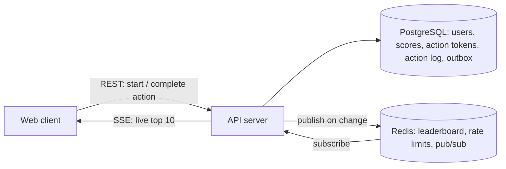
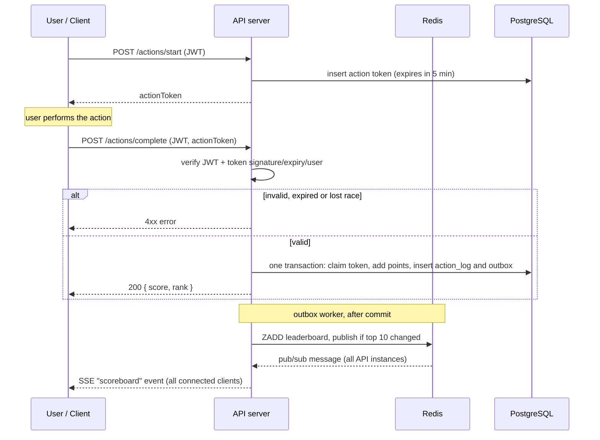

# Problem 6: Live Scoreboard Module — Specification

Specification for the backend API module that powers a live top-10 scoreboard. It is written for the backend engineering team to implement.

> **Implementation details and acceptance criteria are in [spec/](./spec/README.md); where they differ from this overview (e.g. action tokens are stored in PostgreSQL, not Redis), the spec wins.**
>
> A critical review with prioritised fixes is in [improvement.md](./improvement.md). Read it before implementing.

## 1. Requirements

1. The website shows a scoreboard with the **top 10 users by score**.
2. The scoreboard **updates live** (no manual refresh).
3. A user performs an action (its nature is out of scope); completing it **increases the user's score**.
4. On completion, the client dispatches an API call to the application server to update the score.
5. **Malicious users must not be able to increase scores without authorisation.**

## 2. Key design decision: never trust the client's score

Requirement 5 is the hard part. A plain `POST /scores { userId, delta }` can be forged by anyone with curl. So:

- The client **never sends a score or a delta**. The server decides how many points an action is worth.
- The server issues a **short-lived, single-use action token** when an action starts. Completing the action means redeeming that token. A token cannot be forged (signed), replayed (single-use), reused by another user (bound to `userId`), or stockpiled (expires).
- Every request is authenticated and rate limited.

## 3. Architecture



| Component | Responsibility |
|-----------|----------------|
| **API server** (stateless, horizontally scalable) | Auth, action tokens, score updates, serves the scoreboard and live stream |
| **PostgreSQL** | Source of truth: users, score totals, single-use action tokens, append-only action log (audit), outbox |
| **Redis** | Sorted set for fast top-N, rate-limit counters, pub/sub so every API instance can push updates to its connected clients |

Live transport: **Server-Sent Events (SSE)**. Updates are one-way (server to client), SSE auto-reconnects and works over plain HTTP. WebSocket is a valid alternative if the product later needs two-way messaging.

## 4. API

All endpoints except the public scoreboard require `Authorization: Bearer <JWT>`. Errors use `{ "error": "message" }`.

### 4.1 `GET /scoreboard`
Public. Returns the current top 10 (initial page load).

```json
{ "data": [ { "rank": 1, "userId": "u_42", "name": "Alice", "score": 1280 } ], "updatedAt": "2026-10-07T04:00:00Z" }
```

### 4.2 `GET /scoreboard/stream` (SSE)
Public. Pushes the full top 10 whenever it changes (only if the top 10 actually changed, not on every score update).

```
event: scoreboard
data: {"data":[{"rank":1,"userId":"u_42","name":"Alice","score":1280}, ...]}
```

Sends a snapshot immediately on connect and a heartbeat comment every 15s. Clients use `Last-Event-ID`/reconnect and simply render the next snapshot.

### 4.3 `POST /actions/start`
Authenticated. Called when the user begins an action.

Response `201`:
```json
{ "actionToken": "<signed token>", "expiresAt": "2026-10-07T04:05:00Z" }
```
The token is a signed payload `{ jti, userId, actionType, iat, exp }` (HMAC or JWT with a server-only secret). The `jti` is stored in PostgreSQL (`action_tokens`) with an expiry.

### 4.4 `POST /actions/complete`
Authenticated. Called when the action finishes.

Request:
```json
{ "actionToken": "<signed token>" }
```

Server steps (all must pass, otherwise reject):
1. Verify the JWT, then verify the action token signature and expiry.
2. Check `token.userId === jwt.userId`.
3. Atomically claim the `jti` in PostgreSQL (`UPDATE ... WHERE status = 'issued'`). A repeat call by the same user returns the original result; a lost race returns `409`.
4. Optional minimum-duration check (`now - iat >= minDuration(actionType)`) to reject impossibly fast completions.
5. Look up points for `actionType` **server-side**, then in one DB transaction: increment the user's score and insert a row in the action log.
6. After commit, an outbox worker updates the Redis leaderboard (`ZADD` with the absolute score) and, if the top 10 changed, publishes to the pub/sub channel.

Response `200`: `{ "score": 1290, "rank": 3 }`

| Status | Meaning |
|--------|---------|
| 401 | Missing/invalid JWT |
| 403 | Token belongs to a different user |
| 409 | Token already used |
| 410 | Token expired |
| 429 | Rate limit exceeded |

## 5. Execution flow



## 6. Data model

```sql
users       (id PK, name, created_at)
scores      (user_id PK FK, score BIGINT NOT NULL DEFAULT 0, updated_at)
action_log  (id PK, user_id FK, action_type, points INT, token_jti UNIQUE, created_at)  -- append-only audit
CREATE INDEX scores_score_desc ON scores (score DESC);
```

- `token_jti UNIQUE` is a second line of defence against double-crediting.
- Redis `leaderboard` (ZSET, member = userId, score = points) is a cache that can be rebuilt from `scores` on startup or after data loss.

## 7. Security (requirement 5)

| Threat | Mitigation |
|--------|------------|
| Forged "add score" request | Client never sends points; server computes them. Needs a valid action token. |
| Replay of a captured request | Single-use `jti`, atomic claim in PostgreSQL, unique `token_jti` in the action log. |
| Using another user's token | Token bound to `userId` and checked against the JWT. |
| Hoarding tokens to burst later | Short expiry (e.g. 5 min) plus per-user cap on outstanding tokens. |
| Scripted/bot spamming | Per-user and per-IP rate limits (e.g. sliding window in Redis); 429 responses; flag anomalies. |
| Impossible speed | Optional minimum action duration per `actionType`. |
| Token or secret leakage | HTTPS only; secrets in a secret manager; support key rotation (`kid` header). |
| Tampered/injected input | Strict schema validation; parameterised SQL. |
| Disputed scores | Append-only `action_log` allows audit and rollback. |

Limit of this design: the server can only verify that a token was legitimately issued and redeemed, not that the user truly performed the action. If actions have verifiable outcomes (e.g. a game result), validate that on the server inside `/actions/complete`.

## 8. Non-functional notes

- **Performance:** top-10 read is `ZREVRANGE leaderboard 0 9` (O(log N)); fetch names with one cached lookup.
- **Scalability:** API servers are stateless. Redis pub/sub fans updates out to every instance's SSE connections. Cap SSE connections per instance and put them behind a load balancer with long idle timeouts.
- **Consistency:** Postgres is authoritative. If the Redis update fails after commit, a periodic reconciliation job rebuilds the ZSET from `scores`.
- **Throttle pushes:** coalesce stream updates (e.g. at most 1–2 per second) if scoring is very frequent.
- **Observability:** metrics for rejects by reason (401/403/409/410/429), stream connection count, and publish lag.

## 9. Suggested improvements / open questions

1. Decide the points-per-action table and whether points can vary by action (stored server-side as config).
2. Should ties be broken by earliest to reach the score? (Proposed: yes, store `updated_at`, order by `score DESC, updated_at ASC`.)
3. Add a daily/weekly scoreboard (separate ZSETs with TTL) if the product needs it.
4. Add an admin tool to review and revert suspicious `action_log` entries.
5. Consider per-user daily score caps as a blast-radius limit against compromised accounts.

## 10. Suggested implementation layout (follows Problem 5 conventions)

```
src/
├── auth/            # JWT verification middleware
├── actions/         # start/complete: controller, service, token signing, points config
├── scoreboard/      # query, SSE stream, Redis leaderboard + pub/sub
├── middleware/      # rate limiting, error handler
└── db/              # migrations, repositories
```
